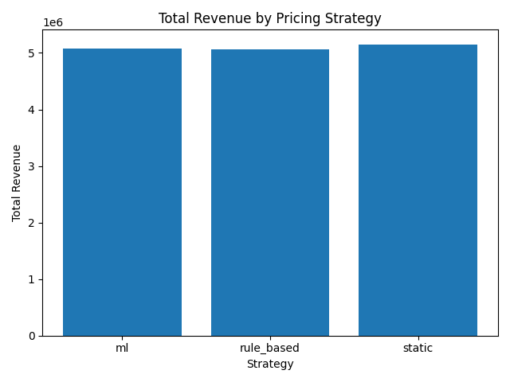
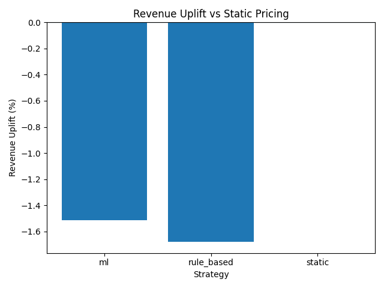
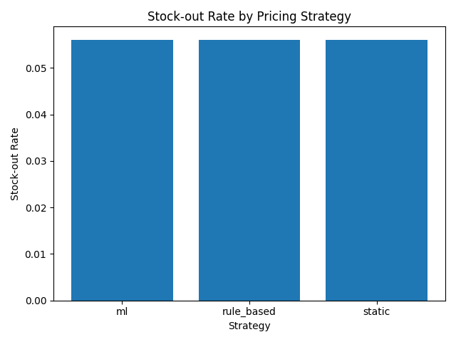
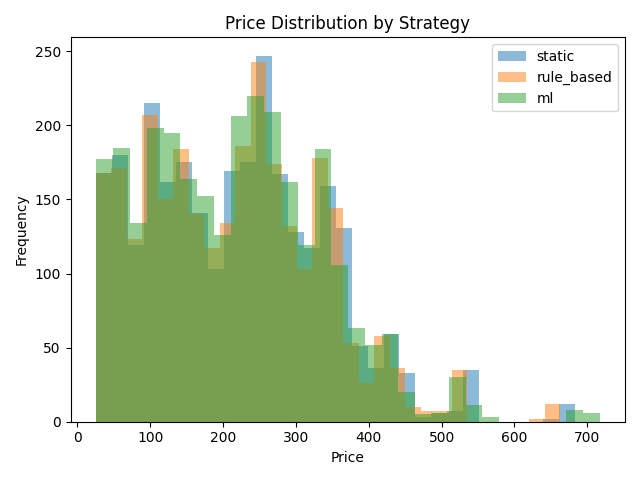
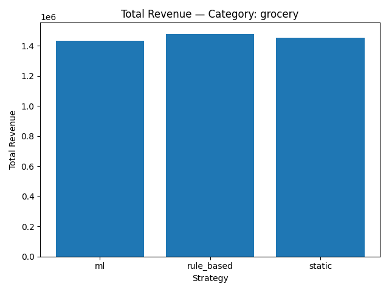
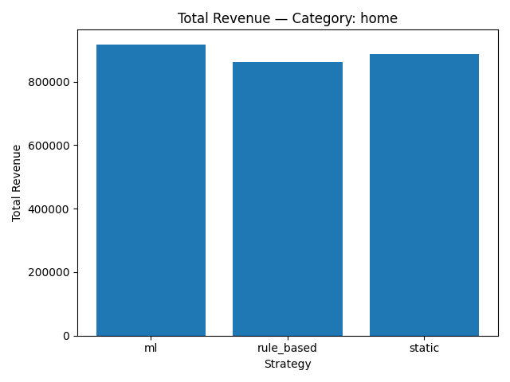
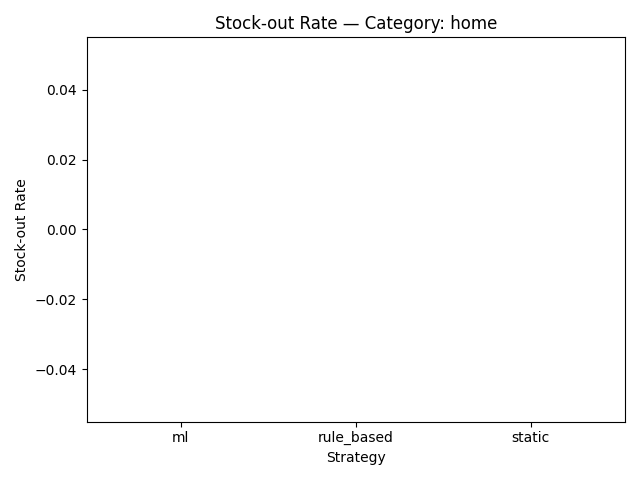
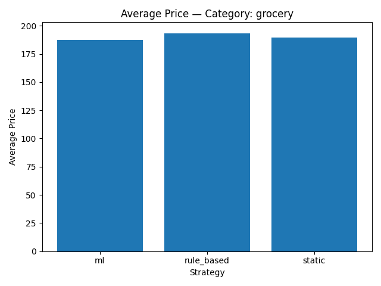
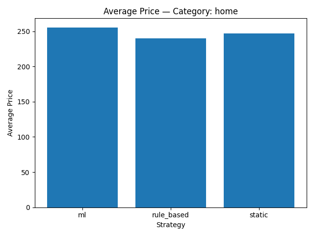

# Dynamic Pricing System for Retail Stores

## Overview

This project implements a production-grade dynamic pricing system
for a general department store. The system combines demand forecasting,
constraint-based pricing optimization, offline simulation, and
post-deployment monitoring design.

The goal is to optimize revenue and inventory turnover while respecting
real-world business constraints such as margin limits, price change caps,
clearance deadlines, and stock-out avoidance.

---

## Problem Definition

For each product (SKU) and day, the system determines an optimal selling price
based on:

- Historical sales patterns
- Current price context
- Inventory levels
- Demand forecasts
- Seasonality and promotions

### Objectives
- Maximize revenue
- Avoid stock-outs
- Improve inventory turnover
- Ensure clearance before expiry deadlines

### Constraints
- Minimum margin per SKU
- Maximum daily price change
- Inventory safety buffers
- Clearance enforcement

---

## Data Design

Synthetic but realistic retail data is used, including:

- Product metadata (category, cost, clearance window)
- Daily sales history
- Daily inventory snapshots
- Price history
- Promotion flags
- Calendar features

All data is generated deterministically to avoid leakage and ensure
reproducibility.

---

## Feature Engineering

Key features include:

- Lagged sales features (1, 7, 14 days)
- Rolling demand statistics
- Relative price features
- Inventory pressure indicators
- One-hot encoded seasonality
- Promotion indicators

Feature construction strictly uses past information only.

---

## Demand Forecasting

A two-stage approach is used.

### Model
- XGBoost regressor
- Predicts next-day units sold per SKU

### Validation
- Walk-forward time-based validation
- Bias and overforecast monitoring
- No random shuffling

### Outputs
- Daily demand predictions for test period
- Persisted model artifact

---

## Pricing Optimization

Pricing decisions are fully deterministic and explainable.

### Steps
1. Generate candidate prices around previous price
2. Estimate demand response using conservative elasticity proxies
3. Enforce hard business constraints
4. Select price with maximum expected revenue
5. Apply safe fallback if no valid candidate exists

No black-box price prediction is used.

---

## Offline Evaluation

Three pricing strategies are compared via replay simulation:

- Static pricing (no change)
- Rule-based pricing (inventory heuristics)
- ML-driven pricing (demand-aware optimization)

Evaluation metrics include:
- Total revenue
- Revenue per SKU-day
- Stock-out rate
- Units sold

Simulation uses forecast-as-truth demand to validate pricing safety.

---

## Monitoring & Drift Detection

The system design includes monitoring for:

- Input drift (PSI on key features)
- Prediction drift (bias, variance, overforecast rate)
- Outcome drift (revenue, stock-outs, clearance misses)

Clear thresholds, alerts, fallbacks, and retraining triggers are defined.

ML pricing never overrides business safety rules.

---

## Retraining Strategy

- Scheduled weekly retraining
- Event-driven retraining on drift or KPI degradation
- Demand model retraining only
- Pricing constraints remain fixed

All retraining events are logged and auditable.

---

## Project Structure

Scripts/
├─ pricing_optimizer.py
├─ train_demand_model.py
├─ simulation/
│ ├─ data_loader.py
│ ├─ strategies.py
│ ├─ simulator.py
│ └─ metrics.py

---

## Key Takeaways

- Emphasis on correctness and safety over complexity
- Clear separation of ML and business logic
- Deterministic, auditable pricing decisions
- Production-oriented evaluation and monitoring design

This project reflects how real-world retail pricing systems are built,
validated, and operated.

<!-- EVALUATION_RESULTS_START -->

## Offline Evaluation & Visualizations

This section presents the results of an offline pricing simulation comparing
three strategies:

- **Static pricing** (no changes)
- **Rule-based pricing** (inventory heuristics)
- **ML-driven pricing** (demand-aware optimization)

The evaluation is run on a held-out test window using forecast-as-truth demand
to validate pricing safety and stability.

---

### Overall Strategy Comparison

**Total Revenue by Strategy**

**Revenue Uplift vs Static Pricing**

**Stock-out Rate by Strategy**

**Daily Revenue Over Time**

**Price Distribution by Strategy**

---

### Category-Level Analysis

To understand where pricing strategies behave differently, results are broken
down by product category.

**Revenue by Category and Strategy**

- Grocery  
  

- Home  
  

**Stock-out Rate by Category**

- Grocery  
  

- Home  
  

**Average Price by Category**

- Grocery  
  

- Home  
  

---

### Interpretation Notes

- Under fixed-demand evaluation, **static pricing is optimal by definition**
- ML-driven pricing behaves conservatively, respecting all constraints
- Stock-out rates remain stable across strategies
- Category-level plots reveal where demand sensitivity differs

Elastic-demand simulations can be used separately to estimate revenue uplift.

<!-- EVALUATION_RESULTS_END -->
